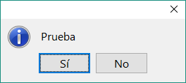
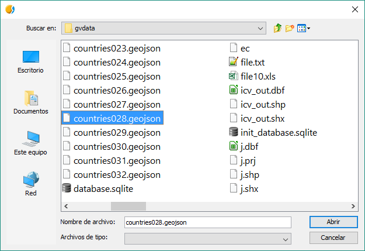
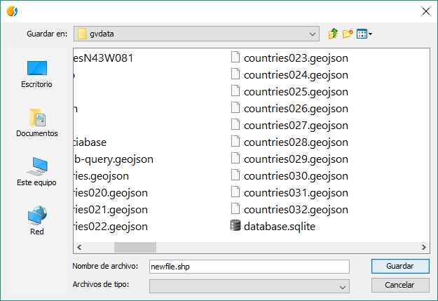

Commonsdialog Module
====================

Main functions
--------------

.. py:function:: msgbox(message[,title="", meesageType=IDEA, root=None])

    Shows a message dialog with ok button only.

    :param str message: text to present in the dialog
    :param str title: title of the dialog
    :param int messageType: type of icon to use.
    :param root: Frame reference
    :type root: DefaultFrame or None

.. py:function:: inputbox(message, [title="", messageType=IDEA, initialValue="", root=None])

    Shows a input dialog.

    :param str message: text to present in the dialog
    :param str title: title of the dialog
    :param int messageType: type of icon to use.
    :param str initialValue: Initial value of the inputbox
    :param root: Frame reference
    :type root: DefaultFrame or None
    :return: Return text in the input box
    :rtype: str

.. py:function:: confirmDialog(message, [title="", optionType=YES_NO, messageType=IDEA, root=None])

    Create a message dialog with options button

    :param str message: text to present in the dialog
    :param str title: title of the dialog
    :param int optionType: bottons to show
    :param int messageType: type of icon to use.

.. py:function:: filechooser(option, [title="", initialPath=None, multiselection=False, filter = None, fileHidingEnabled=True, root=None])

	Allows configuration parameters to filechooser dialogs

    :param int option: file chooser selection mode. Allowed values: OPEN_FILE, OPEN_DIRECTORY, SAVE_FILE
    :param str title: Window title
    :param str initialPath: Initial path to the directory to open in the dialog
    :param boolean multiselection: Allow select more than one object.
    :param filter: list of acepted extension files ("jpg", "png", "gif")
    :type filter: List of Strings
    :param boolean fileHidingEnabled: True if hidden files are not displayed
    :return: Selected path or list of paths

.. py:function:: openFileDialog([title='', initialPath=None, root=None])

	Shows a window dialog to choose one file.

    :param str title: Window title. Default ''
    :param str initialPath: Initial path to open in window dialog

.. py:function:: openFolderDialog([title='', initialPath=None, root=None])

    Shows a window dialog to choose one folder.

    :param str title: Window title. Default ''
    :param str initialPath: Initial path to open in window dialog

.. py:function:: saveFileDialog([title='', initialPath=None, root=None])

    Shows a window dialog to choose one file.

    :param str title: Window title. Default ''
    :param str initialPath: Initial path to open in window dialog

.. py:function:: getJavaFile(path)

    Returns a java File using parameter path. If path doesn't exists looks for user home folder and if can not find it, returns path will be gvSIG instance directory.

    :param str path: String-path.
    :return: Return java.io.File

Library constants
-----------------

Constants appearing inside the commonsdialog module that we will use in different functions::

	*messageType options*
	FORBIDEN = 0
	IDEA= 1
	WARNING= 2
	QUESTION= 3

	*Confirmdialog optionType Options*
	YES_NO = 0
	YES_NO_CANCEL = 1
	ACEPT_CANCEL = 2

	YES = 0
	NO = 1
	CANCEL = 2

	*filechooser options*
	OPEN_FILE = 0
	OPEN_DIRECTORY = 1
	SAVE_FILE = 2

	*filechooser selectionMode*
	FILES_ONLY = JFileChooser.FILES_ONLY
	DIRECTORIES_ONLY = JFileChooser.DIRECTORIES_ONLY

Use case
--------

The commonsdialog module managers the popup windows inside gvSIG. For example, if we want to show a warning to the user, we will use a :py:func:`msgbox`: function. If we want to ask to the user for a value, we could use the :py:func:`inputbox` function with will return a to the script the value ready to be used as a parameter in the code.

To import commonsdialog::

	import gvsig.commonsdialog
	
or::

	from gvsig import commonsdialog
	
or::

	from gvsig.commonsdialog import *
	

	
For example:

.. code-block:: python
	:linenos:
	:emphasize-lines: 1, 5
	
	from gvsig import commonsdialog

	def main(*args):

		commonsdialog.msgbox("Welcome to gvSig","Welcome", commonsdialog.IDEA)

We establish the type of the message in the ``messageType`` parameter as we can see in :py:func:`msgbox`, all the type are stored as constants in the ``commonsdialog`` module.

Also, it depends of how we have imported them.

.. code-block:: python
	:linenos:
	:emphasize-lines: 1, 5
	:caption: msgbox.py
	:name: msgbox-commonsdialog
	
	from gvsig.commonsdialog import *

	def main(*args):

		msgbox("Bienvenido a gvSIG", "Welcome", IDEA)
		

The execution give us as a result this window:

.. figure::  images/commonsdialog-msgbox_1.png
   :align:   center

It depends of the message type how the icon of the window will be:

WARNING:

.. figure::  images/commonsdialog-msgbox_2.png
   :align:   center
   
FORBIDEN:

.. figure::  images/commonsdialog-msgbox_3.png
   :align:   center
   
QUESTION:

.. figure::  images/commonsdialog-msgbox_4.png
   :align:   center
   
   
Dialog types
------------

Differnt dialog types::

	from gvsig import *
	from gvsig import commonsdialog
	from gvsig.commonsdialog import *

	def main(*args):
		
		message = "Test"
		
		mb = commonsdialog.msgbox(message, title="", messageType=IDEA, root=None)
		print "msgbox:", mb

		ib = commonsdialog.inputbox(message, title="", messageType=IDEA, initialValue="", root=None)
		print "inputbox:", ib

		cd = commonsdialog.confirmDialog(message, title="", optionType=YES_NO, messageType=IDEA, root=None)
		print "confirmDialog:", cd

		option = "OPEN_FILE"
		fc = commonsdialog.filechooser(option, title="", initialPath=None,  multiselection=False, filter = None, fileHidingEnabled=True, root=None)
		print "filechooser:", fc

		fc = commonsdialog.filechooser(option, title="", initialPath=None,  multiselection=True, filter = None, fileHidingEnabled=True, root=None)
		print "filechooser:", fc

		ofiled = commonsdialog.openFileDialog(title='', initialPath=None, root=None)
		print "openFileDialog:", ofiled

		ofolderd = commonsdialog.openFolderDialog(title='', initialPath=None, root=None)
		print "openFolderDialog:", ofolderd
		
		sfd = commonsdialog.saveFileDialog(title='', initialPath=None, root=None)
		print "saveFileDialog:",sfd

Msgbox:

.. figure::  images/c_msgbox.png
   :align:   center

Inputbox:

.. figure::  images/c_inputbox.png
   :align:   center
   
Confirm Dialog:

		
File chooser:

		
File chooser with multiselection:

.. figure::  images/c_2.png
   :align:   center
   
Open file dialog:

   
Open folder dialog:

.. figure::  images/c_4.png
   :align:   center
   
Save file dialog:

Console output::

	msgbox: None
	inputbox: 
	confirmDialog: 0
	filechooser: D:\gvdata\countries027.geojson
	filechooser: [u'D:\\gvdata\\countries024.geojson', u'D:\\gvdata\\countries025.geojson', u'D:\\gvdata\\countries026.geojson',
				u'D:\\gvdata\\countries027.geojson', u'D:\\gvdata\\countries028.geojson', u'D:\\gvdata\\countries029.geojson',
				u'D:\\gvdata\\countries030.geojson']
	openFileDialog: [u'D:\\gvdata\\countries028.geojson']
	openFolderDialog: [u'D:\\gvdata\\GISofThrones\\GoTRelease']
	saveFileDialog: [u'D:\\gvdata\\newfile.shp']
