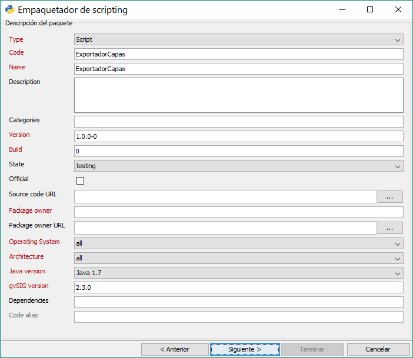
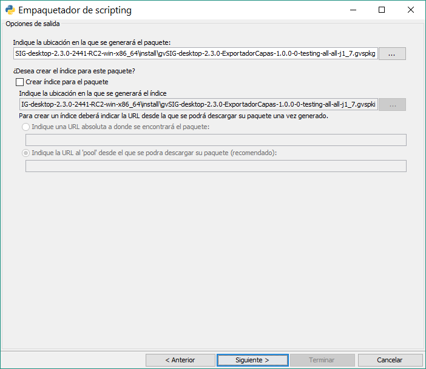

 
Scripting Composer
++++++++++++++++++

.. figure::  images/scripting_composer.png
   :align:   center
   
This is the module’s main screen. Here we can create, sort and store all of our scripts.

The main buttons are: New, Open, Save, Save and Run, Close.. Once we’ve created a new file, we can write our code.

The script execution will be reflected in the console that is at the bottom part.

Jython Console
++++++++++++++

.. figure::  images/scripting_console.png
   :align:   center
   
It is a console that will allow us to run code directly, executing it line by line. It let us check variables and see how they are been modified.

Another interesting feature is that it’ll offer us an aid about the commands that are available according to the code we’re writing, or what kind of methods have available different gvSIG’s classes

gvSIG’s Libraries for Scripting
---------------------------------

We’ve created a library written in Jython called ``gvsig``. Its goal is to add extra methods to these already existing Java classes in the gvSIG’s API and expand through new functions this module’s power and ease of use.

Its goal is to reduce the required number of lines to perform certain operations and to make gvSIG’s API accessible in a simple way from Jython.

The Java libraries that gvSIG is composed are fully accessible from our scripts in Jython, being possible without any access restriction to them as well as creating extensions in the same way that if we did directly in Java.

gvsig’s Library Organization

---------------------------------

This Scripting Module comes with several libraries:

- ``gvsig``: it belongs to gvSIG’s main functions, primarily to data access and management. It contains useful functions and added methods into gvSIG’s classes. It also contains all other modules that we’ll explain.

- ``gvsig.commonsdialog``: it’s responsible of windows generation, from –MISSING SOURCE TEXT- to alert messages of file paths.
- ``gvsig.geom``: It contains all functions related to geometry.

Also, we’ve included another important classes that will help us a lot at scripts generation:

- ``gvsig.libs.formpanel.FormPanel``: This class will help us at scripts generation with visual interfaces. 
- ``gvsig.libs.gvpy``: This library provides geoprocessing execution from Scripting
- ``gvsig.libs.toolbox.ToolboxProcess``: This class is intended to create geoprocesses that will be added to the Toolbox and they can be used from the Modeler.
- ``gvsig.libs.load_project.load_project()``: Function to open a gvSIG from a file.

- etc

It’s hardly recommended to import only the necessary libraries for the script execution.
If our script contains other libraries that we’ve also coded, we should force their reload when they’re imported (or changes won’t be reflected) using the ``reload()`` function. The proper way to do it would be:

    import lib
    reload(lib)

Script creation
---------------------

.. |new| image:: images/icon-new.png

To create a new script, we’ll work in the **Scripting Composer** pressing the button New |new| located above to the left, or :menuselection:`File --> New` will open a window about the kind of script to create.

.. figure::  images/nuevo_script.png
   :align:   center
   
In this window we have to write down the name and description of what we’re going to create. We can choose the file type to create. The options are:

- Script: Program with linear code that we can run.
- Dialog: Program with code and visual interface. (Not recommended, we’ll also use Script type for scripts with visual interface)
- Project: Not enabled yet, for future releases.
- Folder: Creates a folder in our “User scripts” list.

We can choose our preferred programming language. The supported languages are:
- ECMAScript
- Python: it’s the language in which we’ve focused the development.
- Groovy
- R
- Scala

.. figure::  images/nuevo_script_lenguajes.png
   :align:   center

At ``Save on`` we can choose the folder to save our new script. The last two text boxes are about Author’s information and Version.

We make click in "Accept". This will create our new blank script that will be open to be edited. We’ll see that our new script appears in the user’s scripts list and a new tab opens up with the script name. In this tab an asterisk will appear to indicate that the script has unsaved changes. Below appears our default code that has a template with the basic structure, and at the bottom there is the output console.

The scripts created are stored at gvSIG’s folder  ``C:\Users\*\gvSIG\plugins\org.gvsig.scripting.app.extension``. Similarly to Linux’s ``/home/``.

Now, we’re ready to write our first script. The example that comes in the default template is completely valid:

.. code-block:: python
    :linenos:
    :emphasize-lines: 5
    :caption: primer_script.py
    :name: primer-script

    # encoding: utf-8

    import gvsig

    def main(*args):

        #Remove this lines and add here your code

        print "Hello, World"
        pass

First, it performs an import of the library that we’re going to use, the ``gvsig`` scripting library, then it defines inside main function main(), the print command that will output our value through the console.

.. figure::  images/scripting_composer_2.png
   :align:   center

In gvSIG’s Scripting, the default function that will **always be executed is the main() function**. Thus, we have to write all our code inside of this function.

.. note::

   All of our scripts must have the main() function to its proper execution. This won’t be required if they’ll be used as libraries.

.. |saveandexecute| image:: images/icon-saveandexecute.png

To run a script saving |save| and running |execute| or we directly pressing the button |saveandexecute| and we’ll see its execution through the console.

We can make sure that the console’s output is “Hello, World” that is the goal we were looking for. Now, we have successfully run our first script.

This is the script’s basic structure in gvSIG 2.3.

If we open the Scripting Launcher now, at the Scripting menu, we’ll see that our script appears in the new listing.

If we want to make sure that our scripts are in the hard disk, they’ll be at the folder:

- In a Windows’s installable version: ``C:\Users\UserName\gvSIG\plugins\org.gvsig.scripting.app.extension\scripts``

- In a Windows’s portable version: ``\gvSIG_install_folder\home\gvSIG\plugins\org.gvsig.scripting.app.extension\scripts``

In this folder we can copy or paste our scripts making sure of taking both ``.py`` and ``.inf`` files.

.. note::

	It’s advisable to generate each script inside its own folder. This will allow us to use them as modules, giving us several options like: autorun.py file (autoexecutable at gvSIG’s startup time), __init__.py file (this will allow us to work as a module, letting us to import libraries that are in the same folder), and script’s packages creation.

Generating script’s packages
-----------------------------

Once we’ve created a script in its own folder with everything that is required, we can generate a gvSIG’s package ``.gvspkg`` to be shared or uploaded. With this package we can **perform an installation of the script from the Plugin Manager**. Its user is very intuitive.

The tool is located in the Scripting Composer, at the menu  :menuselection:`Tools --> Script Package`.

We will select the folder that contains our extension:

.. figure::  images/empaquetador_1.png
   :align:   center

We will set the package’s properties:

Then the output options:

The path will be similar to this: ``gvSIG-desktop-2.3.0-2441-RC2-win-x86_64\install\gvSIG-desktop-2.3.0-LayerExporter-1.0.0-0-testing-all-all-j1_7.gvspkg``. 

   
And it’s done, our extension will appear in ``.gvspkg`` format, ready to be installed by the Plugin Manager.

.. figure::  images/empaquetador_4.png
   :align:   center
