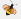
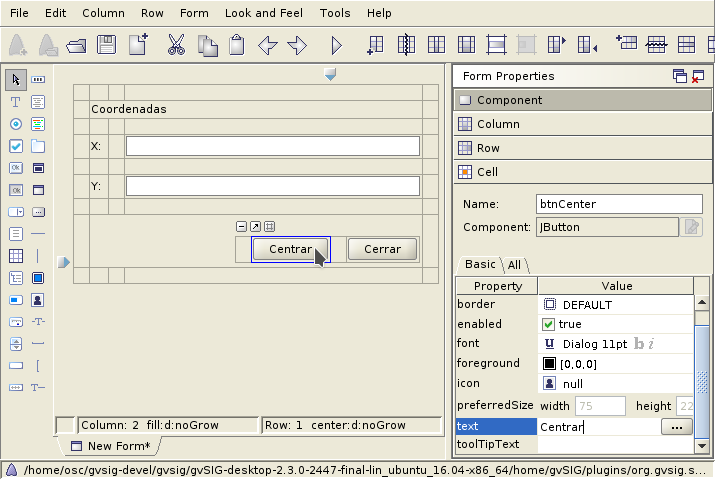
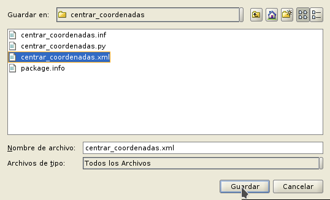
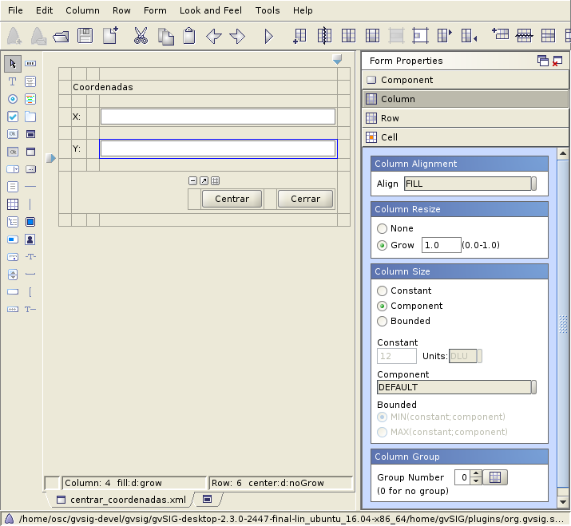
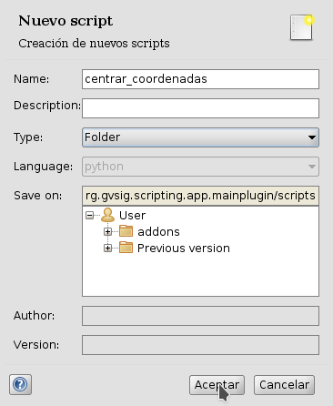
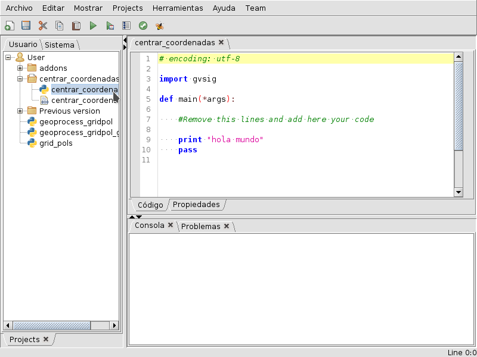

Visual Interface
================

Abeille
-------
We use Abeille to create visual interfaces. On this program we can stablish windows aspect, names, ec. Using FormPanel library we can easily load on a script, 

We opened the Abeille from the button | abeille | located on the Scripting Composer toolbar.

.. note::
   Remember, if you want to see Abeille toolbar, we must instal **ScriptingComposerTools** we could download from the complement administrator.

The Abeille program appears in the image with the example coordenadas.xml:   

.. figure::  images/abeille.png
   :align:   center

Use example
-----------
Download the example explained below: :download:`CentrarCoordenadas <ejemplos/gvSIG-desktop-2.3.0-centrar_coordenadas-1.0.0-2-testing-all-all-j1_7.gvspkg>`

.. figure::  images/abeille_1.png
   :align:   center

To create a visual interface we create a new form on Abeille.   

.. figure::  images/abeille_2.png
   :align:   center

We create a new label ``label``.

.. figure::  images/abeille_3.png
   :align:   center

We pressed the place where we want it on the grid.

.. figure::  images/abeille_4.png
   :align:   center 

Now we can name the label. With this name we will acces the component from our script. In this case, we name it ``lblName``.

We change the text will contain this laber to: *Coordinates* 

.. figure::  images/abeille_6.png
   :align:   center

You can extend the box range on the form to fit better the interface we are going to create.In this case we want it covering 3 columns of the grid, leaving a column on each side so the components we're creating are not together on the edge of the window.

.. figure::  images/abeille_7.png
   :align:   center

We see the rank of the coordinate label was extended. On this script interface we use 5 columns, 3 to situate the components but the others to separate the edges.Now we can remove those columns we are not going to use with "Delete Columns".  

.. figure::  images/abeille_71.png
   :align:   center 

We will expand the width of some columns form for better viewing, but by the end we will explain some other options to do this automatically and assure proper viewing. Thus, we only have to press on the column to modify and displace the sign appearing on the top right.

.. figure::  images/abeille_72.png
   :align:   center

We repeat the proces to create two new labels named ``lblX`` & ``lblY``, with text "X: " e "Y: " respectively. We leave one row between each of them for better visualize:

.. figure::  images/abeille_8.png
   :align:   center

Now we create a  `text field``. This field allow us show values and introduce them:  

.. figure::  images/abeille_9.png
   :align:   center

We repeat the previous proces to create two *text fields* named ``txtX`` y ``txtY``.

.. figure::  images/abeille_10.png
   :align:   center

To the column where the text box is situated, we will give it the expansion possibility needed, e.g, if the user expand the window. This option help to hold correctly viewing the interface, and give us the option detailing the components we allow resize.

To do this, we will select some column celd who contain the component text box, we will go to up menu: menuselection:`Column --> Resize: Grow`. 

.. figure::  images/abeille_101.png
   :align:   center

We see how the previewing of the form has changed, being resize useing the designated column. 

.. figure::  images/abeille_102.png
   :align:   center

The following step was create spaces for the aplication buttons, in this case, will be two. The first button do the action Center:``btnCenter``, the next do the action Close: ``btnClose``.

In order to get more freedom on the position and size configuration for the buttons, we will do it as below.

First we will create a component "Embedded Form". this option allows insert a form inside another.

We situate the new component down the last label, leaving a separating row:

.. figure::  images/abeille_104.png
   :align:   center

Appear a window indicating the form size we want insert, we indicate 4 columns and 1 row. Then we have space to situate the buttons and leave separating betwen them.

.. figure::  images/abeille_105.png
   :align:   center

Giving a result like:

Once insert, we will indicate ocuppy the two following columns, as we have done with the first coordinate label, using ``Increse Column Span``.

.. figure::  images/abeille_107.png
   :align:   center

Leaving a separating row for bottom edge, we can eliminate surplus rows. The result will be like:

.. figure::  images/abeille_108.png
   :align:   center

We will indicate to the subform will aligned on right of cell who contain it. We push on this cell on the right :menuselection:`Form Properties --> Cell --> Alignment --> Horizontal --> RIGHT`, leaving the follow result:

Now we can create buttons on this subform, ``btnCenter`` & ``btnClose``. We select the option jButton:

.. figure::  images/abeille_110.png
   :align:   center

Then we place those two buttons inside the subform:

If we face a more complicated case, there is a option to extend this subform :

.. figure::  images/abeille_112.png
   :align:   center

The form appears in a diferent tab:

.. figure::  images/abeille_113.png
   :align:   center

Now we will already have made the interface, only we will have to save on the script's directory with the extension ``.xml``:

At any times we can make changes on the interface by open the file ``.xml`` from Abeille.

Here we see how the program respond to diferent sizes:

.. figure::  images/abeille_115.png
   :align:   center

From the code we can stablish the window size we want with the line ``self.setPreferredSize(300,300)``, thus we see some like below:

    from gvsig import *
    from gvsig.libs.formpanel import FormPanel

    class Panel(FormPanel):
        def __init__(self):
            FormPanel.__init__(self, os.path.join(os.path.dirname(__file__), "ui_basic.xml"))
            self.setPreferredSize(300,300)

    def main(*args):
        l = Panel()
        l.showTool("Visual")
        pass

We also have many more options that allow us to configure in detail the react of our interface components, such as menu options Column:

FormPanel use
-------------
For creating visual scripts we will rely in the FormPanel class contained on ``gvsig.libs.formpanel``. We will create a new class containing our script functionality and will extend from FormPanel.

First we are going to create a new folder so we put our example into it.

Then, we create a script on this folder named *center_coordinates.py*  

.. figure::  images/abeille_script_2.png
   :align:   center

We will save the form explained above on this folder.   

Loading an interface form script::

    from gvsig import *
    from gvsig.libs.formpanel import FormPanel
    import os

    class Panel(FormPanel):
        def __init__(self):
            FormPanel.__init__(self, os.path.join(os.path.dirname(__file__), "ui_basic.xml"))

    def main(*args):
        l = Panel()
        l.showTool("Visual")
        pass

Based on this template we create our new script *center_coordinates.py*.

By default, FormPanel has stablished a method ``btnClose_click``, which will be use to close the script. Thus we only have to establish on Abeille a button called `` btnClose`` and we will have scheduled a closing button for the app.

We have our module ready to be programmed. We have a folder containing the script and the interface to use.

We continue developing the FormPanel functionalities. One of them is the auto link with events occurring on the visual interface elements. E.g. if we have a button named ``btnCenter`` and we want this react when we press on it, we just create a method in our class that contains the name of the element "btnCenter" finished with the event we want to capture "_CLICK".

By this way we have no needs to worry about the events, the FormPanel library manages these events::

    # encoding: utf-8

    from gvsig import *
    from gvsig.libs.formpanel import FormPanel
    import os

    class CenterCoordinates(FormPanel):
        def __init__(self):
            FormPanel.__init__(self, 
                                os.path.join(os.path.dirname(__file__), 
                                            "center_coordinates.xml")
                                )

        def btnCenter_click(self, *args):
            print "Clicked!"
        
        def btnClose_click(self,*args):
            self.hide()
        
    def main(*args):
        l = CenterCoordinates()
        l.showTool("Center Coordinates")
        pass

When we execute the script will appear an interface as below:  

.. figure::  images/abeille_script_4.png
   :align:   center

As happens when you press *Center* button, as programed with the method *btnCenter_click*, console display the word *Clicked!*.

.. figure::  images/abeille_script_5.png
   :align:   center

If we press *Close* button the app will be close, by using the already implemented method class *FormPanel*, whitout need to be programed by us. 

E.g. eaven we could modify the label text or other values :

    self.txtX.setText("Clicked!")
    self.txtY.setText("Clicked!")

.. figure::  images/abeille_script_7.png
   :align:   center

As we have seen, to acces our interface components, we will do through *self. + component's name.*. E.g. we are going to implement that the "Center" button show us the coordinates of text box on console.

To do that we refer to the box text components ``txtX`` y ``txtY`` we have programed on the interface::

    def btnCenter_click(self, *args):
        x = self.txtX.getText()
        y = self.txtY.getText()
        print "X: ", x, " Y: ", y

Here we see how it looks like:      

.. figure::  images/abeille_script_6.png
   :align:   center

Now, to fulfill the script propose, center coordinate view,we need just modify the method *btnCenter_click* as below:     

    # encoding: utf-8

    from gvsig import *
    from gvsig import geom
    from gvsig.libs.formpanel import FormPanel
    import os

    class CenterCoordinates(FormPanel):
        def __init__(self):
            FormPanel.__init__(self, 
                                os.path.join(os.path.dirname(__file__), 
                                            "centrar_coordenadas.xml")
                                )

        def btnCenter_click(self, *args):
            x = float(self.txtX.getText())
            y = float(self.txtY.getText())
            point = geom.createPoint2D(x, y)
            currentView().centerView(point.getEnvelope())
        
        def btnClose_click(self,*args):
            self.hide()
        
    def main(*args):
        l = CenterCoordinates()
        l.showTool("Centrar Coordenadas")
        pass

With the following result:

We see how the coordinates view we have indicated on text box has centered.

Deal with different components
------------------------------

RadioButton's Groups
+++++++++++++++++++++

A common function from the habitual interface is to create RadioButton's group for the selection between many options. In general, this options come in group and only allow the selection between them. We must do this group by code as below.

After to generate the interface on the method ``__init__``from``FormPanel.__init__(..)``, we must to create a button's group and add one by one those who belong to the group, e.g::

    from javax.swing import ButtonGroup
    ...
    self.btgAnswers = ButtonGroup()
    self.btgAnswers.add(self.rdbOption1)
    self.btgAnswers.add(self.rdbOption2)

Being ``rdbOption1`` & ``rdbOption2``, component's type **RadioButton** from the interface.

Self registered events
----------------------

We have commented that FormPanel handles link the components events with our script, but not all possible event of each interface element are implemented from FormPanel (but if you need any of them could be added or implement your own class) . Here are some of these events with reference to *spinners*, *combobox*, ec::

        def btnCalcular_click(self, *args):
            self.txtField.setText("Clicked!")
            print "Clicked!"

        def chb1_change(self, *args):
            print "Check box!"

        def rb1_change(self, *args):
            print "Radio button!"

        def cmb1_change(self, *args):
            print "Combobox!"

        def sld1_focusGained(self, *args):
            print "Slider!", sld1.getValue()

        def spn1_change(self, *args):
            print "Spinner!"

        def btnClose_click(self,*args):
            self.hide()
